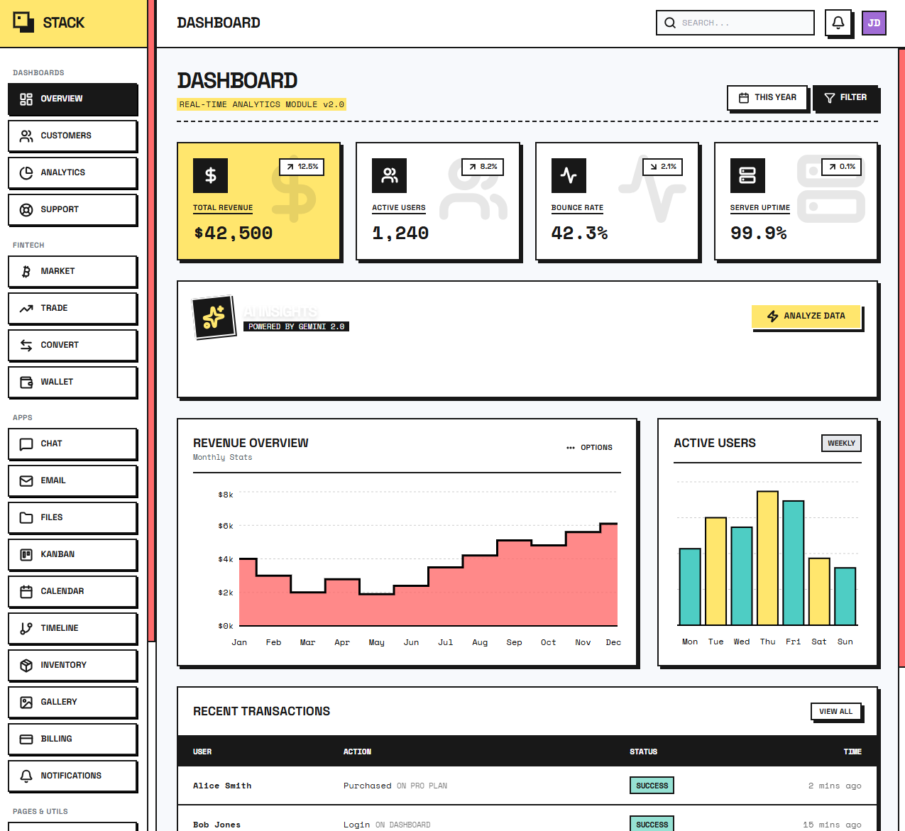
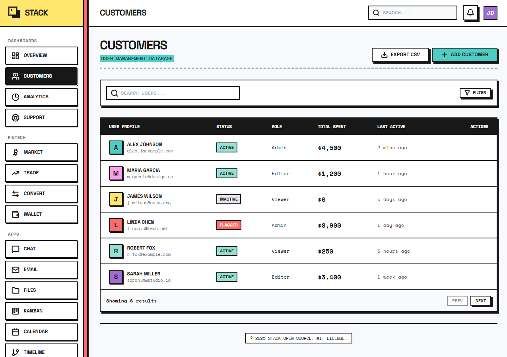
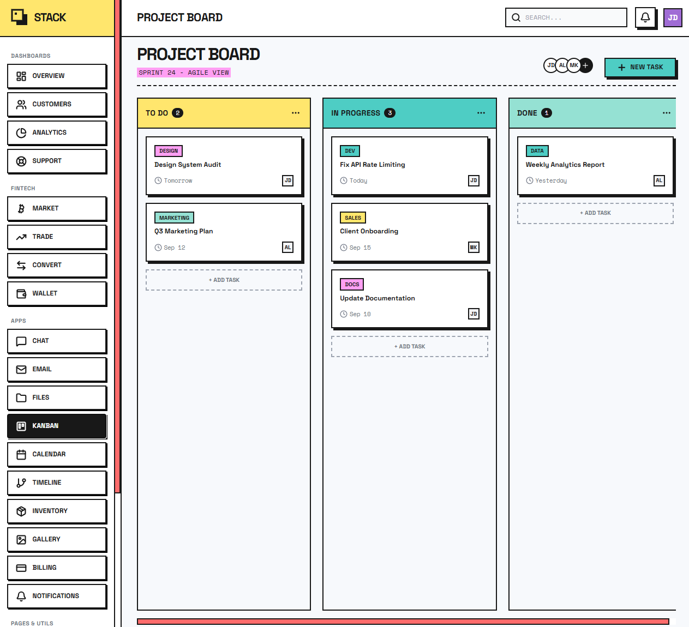
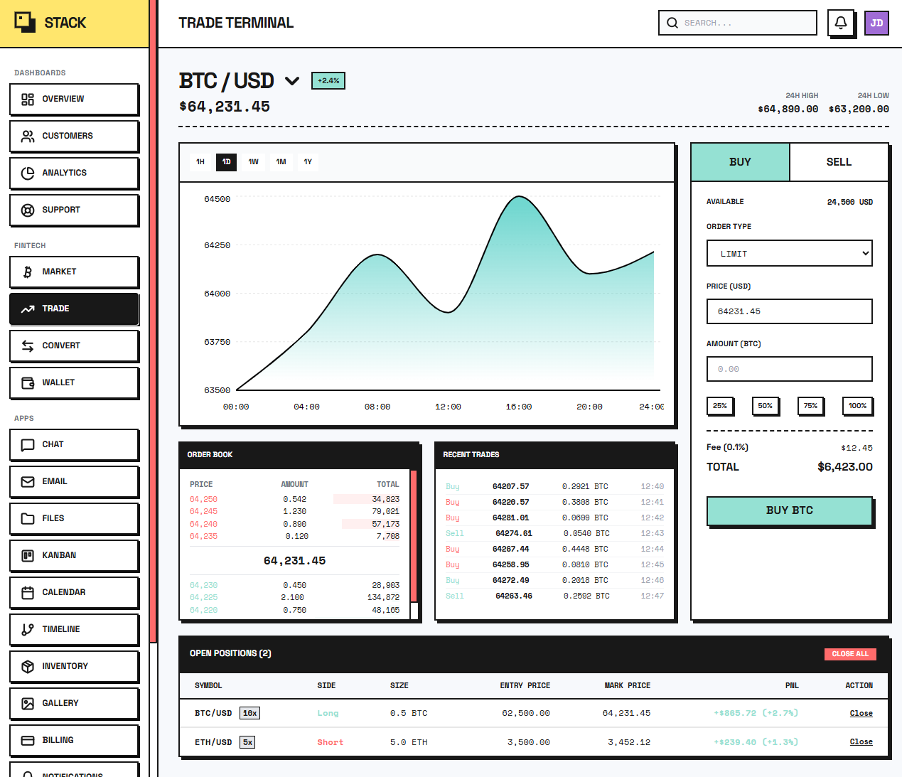
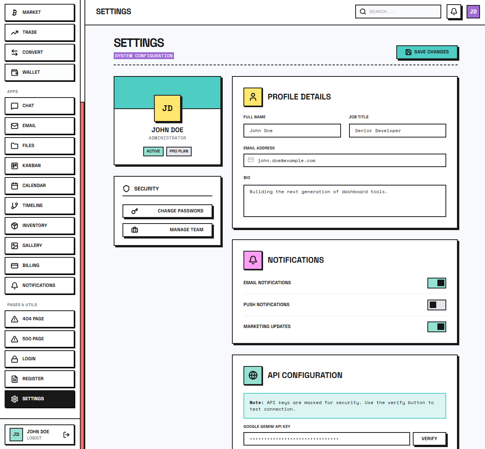
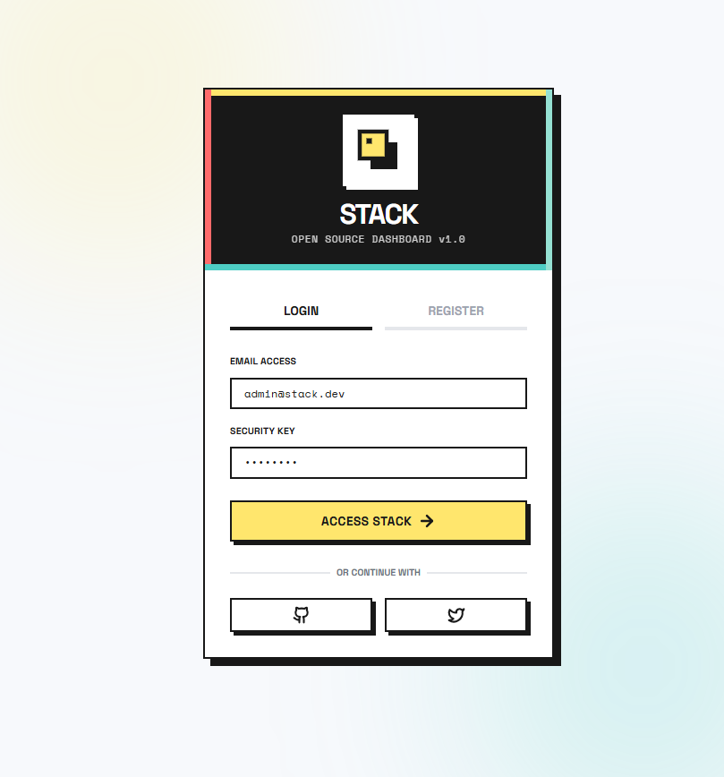

<div align="center">
  # STACK Dashboard

  **A modern, open-source dashboard with neo-brutalist design**

  [](https://react.dev/)
  [](https://www.typescriptlang.org/)
  [](https://vitejs.dev/)
  [](LICENSE)

  [Features](#features) &bull; [Demo](#demo) &bull; [Installation](#installation) &bull; [Contributing](#contributing)
</div>

---

## Overview

STACK Dashboard is a feature-rich, single-page application built with React 19, TypeScript, and Vite. It showcases a distinctive neo-brutalist design system with 19+ fully functional page components and real-time analytics.

Perfect as a starting point for admin dashboards, business tools, or as a reference implementation for modern React patterns.

## Demo

🚀 **Live Demo:** [https://tje3d.github.io/stack-dashboard/](https://tje3d.github.io/stack-dashboard/)

## Screenshots

### Main Dashboard


### Business Tools


### Project Management


### Crypto Trading


### Settings


### Authentication


## Features

### Core Dashboard
- **Real-time Metrics** - Animated stat cards with trend indicators
- **Interactive Charts** - Revenue and activity visualizations with Recharts
- **Activity Feed** - Real-time user activity tracking

### Business Tools
- **Customer Management** - CRM-style customer table with actions
- **Analytics** - Data visualization and reporting
- **Support Tickets** - Ticket management system
- **Kanban Board** - Drag-and-drop task management
- **Billing** - Invoice and payment tracking
- **Inventory** - Stock management interface

### Applications
- **Chat** - Real-time messaging interface
- **Email Client** - Full email management UI
- **File Manager** - Browse and manage files
- **Calendar** - Event scheduling and management
- **Timeline** - Project timeline visualization
- **Gallery** - Image gallery with grid view

### Crypto Suite
- **Market Overview** - Cryptocurrency market data
- **Trading Terminal** - Buy/sell interface
- **Wallet** - Portfolio tracking
- **Converter** - Real-time crypto exchange rates

### System
- **Settings** - User preferences and configuration
- **Notifications** - Alert management center
- **Authentication** - Login page (demo)

## Tech Stack

| Technology | Purpose |
|------------|---------|
| [React 19](https://react.dev/) | UI Framework |
| [TypeScript](https://www.typescriptlang.org/) | Type Safety |
| [Vite](https://vitejs.dev/) | Build Tool |
| [Tailwind CSS](https://tailwindcss.com/) | Styling (CDN) |
| [Recharts](https://recharts.org/) | Data Visualization |
| [Lucide React](https://lucide.dev/) | Icon Library |

## Installation

### Prerequisites
- Node.js 18+
- npm or yarn

### Steps

1. **Clone the repository**
   ```bash
   git clone https://github.com/tje3d/stack-dashboard.git
   cd stack-dashboard
   ```

2. **Install dependencies**
   ```bash
   npm install
   ```

3. **Run the development server**
   ```bash
   npm run dev
   ```

   Open [http://localhost:3000](http://localhost:3000) in your browser.

## Project Structure

```
stack-dashboard/
├── components/
│   ├── layout.tsx           # Sidebar & Header
│   ├── DashboardWidgets.tsx # Dashboard components
│   ├── ui.tsx               # Reusable UI elements
│   └── [Pages]/             # Individual page components
├── types.ts                 # TypeScript definitions
├── App.tsx                  # Main application
├── index.tsx                # Entry point
├── index.html               # HTML template + Tailwind config
└── vite.config.ts           # Vite configuration
```

## Design System

STACK uses a custom neo-brutalist design language defined in `index.html`:

- **Colors**: neo-yellow, neo-red, neo-blue, neo-green, neo-purple, neo-pink, neo-black
- **Shadows**: 4px offset for distinctive depth
- **Typography**: Space Grotesk (headings), Space Mono (code)
- **Borders**: Heavy 2px solid borders for high contrast

## Building for Production

```bash
npm run build
```

Preview the production build:
```bash
npm run preview
```

## Contributing

Contributions are welcome! Please follow these steps:

1. Fork the repository
2. Create a feature branch (`git checkout -b feature/amazing-feature`)
3. Commit your changes (`git commit -m 'Add amazing feature'`)
4. Push to the branch (`git push origin feature/amazing-feature`)
5. Open a Pull Request

### Development Guidelines
- Follow existing code patterns and component structure
- Maintain the neo-brutalist design consistency
- Add TypeScript types for new props/interfaces
- Test across different screen sizes (responsive design)

## License

This project is licensed under the MIT License - see the [LICENSE](LICENSE) file for details.

## Acknowledgments

- Design inspiration from neo-brutalist design movement
- Icons by [Lucide](https://lucide.dev/)
- Fonts by [Google Fonts](https://fonts.google.com/)

---

<div align="center">
  <b>Made with React 19 & TypeScript</b>

  [GitHub](https://github.com/tje3d/stack-dashboard) &bull; [Report Bug](../../issues) &bull; [Request Feature](../../issues)
</div>
